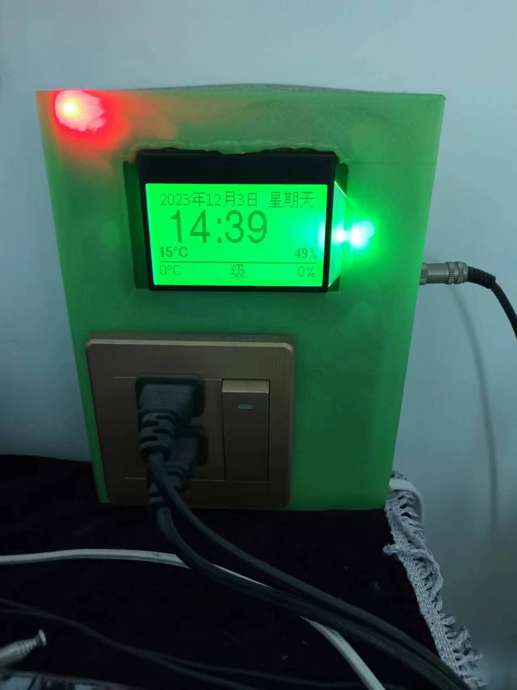
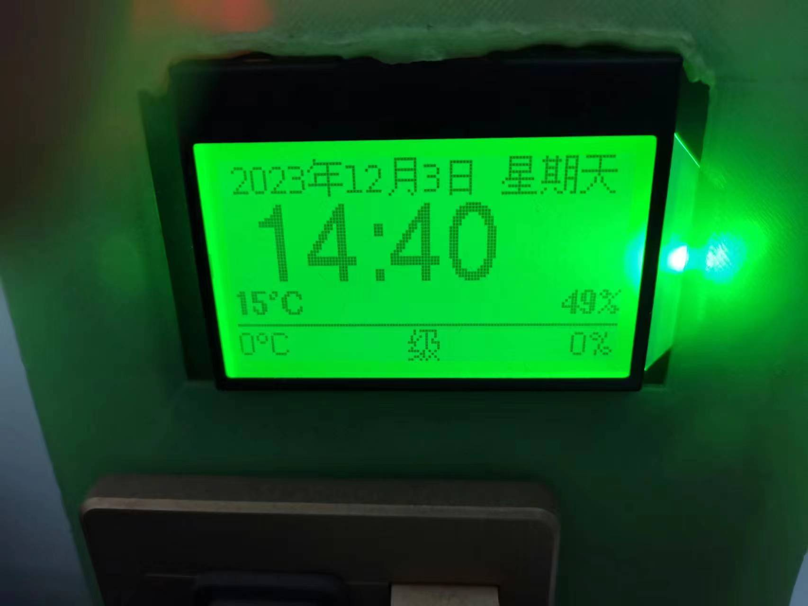

# ESP12-PianoHumidityControl-SPI-Mini12864-zh

Maintains a piano's internal relative humidity around 50% RH: an ESP-12
(ESP8266) reads an internal DHT-series temperature/humidity probe and
switches a relay (driving a small heater/dehumidifier) when humidity exceeds
a threshold, while a 128x64 SPI LCD shows the current outside weather
alongside the internal readings.

 

## Hardware

See [Wiring.txt](Wiring.txt) for the "Mini 12864" ST7565 LCD pin mapping.
`DISPLAY_TYPE` at the top of the .ino also supports two other 12864 display
variants (see the comment on that `#define`) - for the "New Big Blue 12864"
variant (`DISPLAY_TYPE 3`) you additionally need the patched u8g2 driver from
[esp8266-ST7565-u8g2LibFix](https://github.com/bobhuang1/esp8266-ST7565-u8g2LibFix).

## Setup

1. Install dependencies: `U8g2`, `WiFiManager`, `DHT sensor library` (+
   `Adafruit Unified Sensor`), `Timezone`, `JsonStreamingParser`,
   `ESP8266HTTPClient`/`ESP8266httpUpdate` (bundled with the ESP8266 Arduino
   core).
2. This sketch vendors its shared dependencies directly so it builds
   standalone - **replace their placeholder credentials/servers before
   flashing**:
   - `WeatherApiWeather.h`/`.cpp` ([source](https://github.com/bobhuang1/esp8266-weather-WeatherApi)) -
     set `WEATHERAPI_LOCATION` below the `#include`s to your city (or
     `"auto:ip"` when `USE_WIFI_MANAGER` is enabled), and set
     `WEATHERAPI_APP_ID` (also below the `#include`s) to your
     [WeatherAPI.com](https://www.weatherapi.com/) key.
   - `StringHelpers`, `BacklightController`, `WiFiMultiConnect`,
     `WeatherDisplayHelpers`, `DeviceFleetClient`, `BootSplashBitmap`
     ([source](https://github.com/bobhuang1/ESP8266-Functions-Common)) -
     set `WIFI_SSIDS`/`WIFI_PASSWORDS` to your own network(s), or enable
     `USE_WIFI_MANAGER` instead of hardcoding credentials at all.
   - If you update any shared library, re-copy its `src/` files here.
3. This sketch also expects a small device-fleet "settings server" backend
   (`DeviceFleetClient`, used here via the `fleet` object for per-device
   config, OTA firmware version checks, and logging readings) - see
   `DeviceFleetClient`'s README if you want to stand one up, or strip those
   calls out of `setup()`/`updateData()` if you don't need remote fleet
   management for a single device.

## Notes

- Originally used a now-defunct HeWeather API endpoint; migrated to
  [WeatherAPI.com](https://www.weatherapi.com/) (see
  [esp8266-weather-WeatherApi](https://github.com/bobhuang1/esp8266-weather-WeatherApi)).
  WeatherAPI.com doesn't expose a discrete wind-scale/level field the way the
  old API did, so the wind display now shows km/h instead of a 1-12 scale
  number.
- `#define LANGUAGE_CN` / comment it out to switch the on-screen text between
  Chinese and English.
